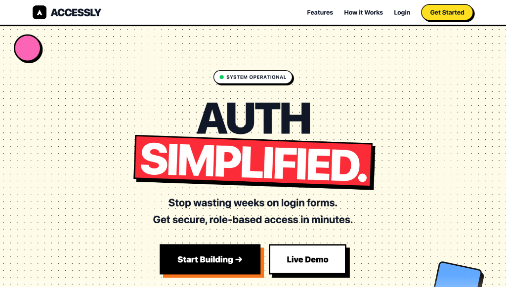
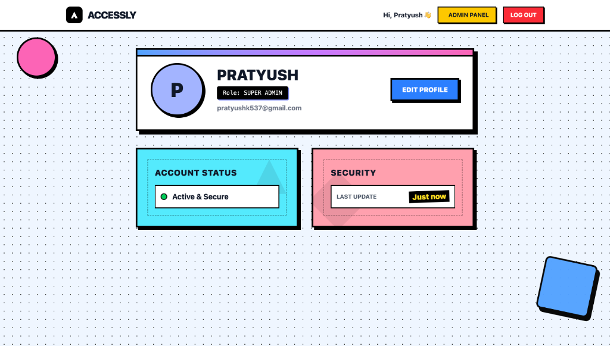
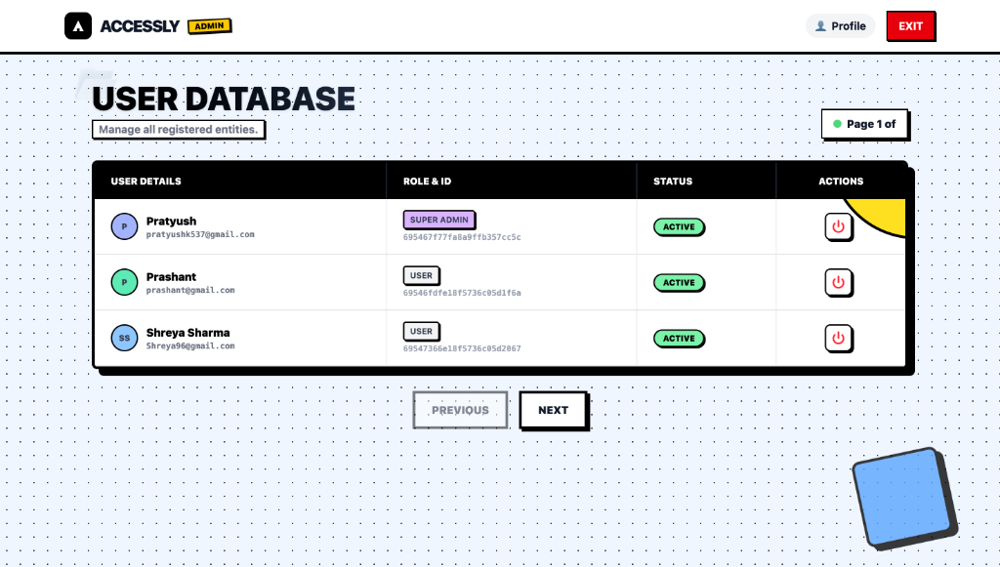
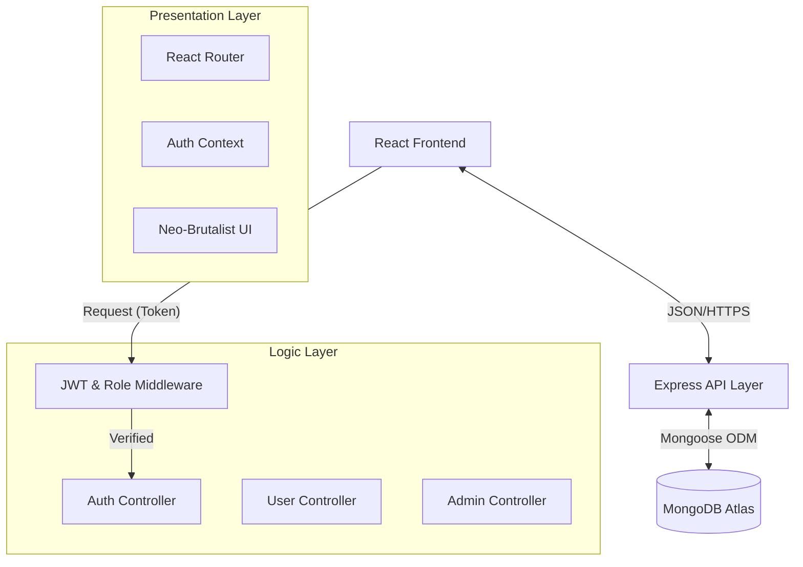

# 🚀 ACCESSLY
### **Secure. Scalable. Role-Based Access Control.**



> **"Stop wasting weeks on login forms. Get secure, role-based access in minutes."**

---

## 📖 **Overview**

**Accessly** is a production-ready **User Management System (UMS)** designed to simplify authentication and authorization for modern web applications. Built with the **MERN Stack** (MongoDB, Express, React, Node.js), it features a robust **Role-Based Access Control (RBAC)** architecture, distinguishing strictly between *Admin* can *User* privileges.


---

## ✨ **Key Features**

### 🔐 **Core Security**
*   **JWT Authentication:** Stateless, secure session management using JSON Web Tokens.
*   **Bcrypt Hashing:** Industry-standard password encryption.
*   **Protected Routes:** Client-side and Server-side middleware to prevent unauthorized access.
*   **RBAC Architecture:** Strict separation of `USER` and `ADMIN` roles.

### 👤 **User Experience**

*   **Dynamic Profile:** Users can update their details, change passwords, and view their unique system status.
*   **Responsive:** Fully optimized for Mobile, Tablet, and Desktop.

### 🛠 **Admin Power**
*   **Centralized Dashboard:** View all users in a paginated, sortable interface.
*   **One-Click Actions:** Instantly Activate or Deactivate user accounts.
*   **Visual Status Indicators:** Clear cues for active/inactive users and admin privileges.

---

## 📸 **Screenshots**

### **1. Landing Page**
*High-impact introduction with clear CTA and feature highlights.*


### **2. User Profile**
*Personalized dashboard with "Neo-Brutalist" status cards and dynamic avatar.*


### **3. Admin Dashboard**
*Powerful management interface with "Ghost Button" controls and status indicators.*


---

## 🏗 **Architecture**

Accessly follows a **Layered Architecture** to separate concerns and ensure scalability.



### **Tech Stack**

| Layer | Technology |
| :--- | :--- |
| **Frontend** | React, Vite, Tailwind CSS, Axios, Lucide React |
| **Backend** | Node.js, Express.js |
| **Database** | MongoDB Atlas (Cloud) |
| **Auth** | JWT (JSON Web Tokens), BCrypt.js |
| **DevOps** | Render (Backend), Vercel (Frontend) |

---

## 🚀 **Getting Started**

### **Prerequisites**
*   Node.js (v16+)
*   MongoDB Atlas URI

### **1. Clone the Repository**
```bash
git clone https://github.com/pratyushkumar/Accessly.git
cd Accessly
```

### **2. Backend Setup**
```bash
cd backend
npm install

# Create .env file
echo "PORT=5001" >> .env
echo "MONGO_URI=your_mongodb_connection_string" >> .env
echo "JWT_SECRET=your_super_secret_key" >> .env

# Start Server
npm run dev
```

### **3. Frontend Setup**
```bash
cd ../frontend
npm install

# Start Client
npm run dev
```

Visit `http://localhost:5173` to view the application.

---

## 🔧 **Environment Variables**

Create a `.env` file in the `backend/` directory with the following variables:

| Variable | Description | Example |
| :--- | :--- | :--- |
| `PORT` | Port for the backend server | `5001` |
| `MONGO_URI` | MongoDB Connection String | `mongodb+srv://...` |
| `JWT_SECRET` | Secret key for signing tokens | `mysecretkey` |

---

## 📖 **API Documentation**

### **Authentication**
| Method | Endpoint | Description | Public? |
| :--- | :--- | :--- | :--- |
| `POST` | `/api/auth/signup` | Register a new user | ✅ |
| `POST` | `/api/auth/login` | Login user & get JWT | ✅ |
| `GET` | `/api/auth/me` | Get current user profile | ❌ |

**Example Request (Login):**
```json
POST /api/auth/login
{
  "email": "user@example.com",
  "password": "password123"
}
```

**Example Response:**
```json
{
  "token": "eyJhbGciOiJIUzI1NiIsInR5cCI..."
}
```

### **User Operations**
| Method | Endpoint | Description | Public? |
| :--- | :--- | :--- | :--- |
| `PUT` | `/api/users/profile` | Update user details (Name/Email) | ❌ |
| `PUT` | `/api/users/updatepassword` | Change account password | ❌ |

### **Admin Operations**
| Method | Endpoint | Description | Public? |
| :--- | :--- | :--- | :--- |
| `GET` | `/api/admin/users` | Get all users (Paginated) | ❌ (Admin) |
| `PUT` | `/api/admin/users/:id/status` | Activate/Deactivate User | ❌ (Admin) |

**Example Request (Update Status):**
```json
PUT /api/admin/users/12345/status
{
  "isActive": false
}
```

---

## 🌍 **Deployment**

### **Backend (Render/Railway)**
1.  Push code to GitHub.
2.  Connect repository to **Render**.
3.  Set Build Command: `npm install`
4.  Set Start Command: `node server.js`
5.  Add Environment Variables (`MONGO_URI`, `JWT_SECRET`).

### **Frontend (Vercel)**
1.  Connect repository to **Vercel**.
2.  Set Root Directory to `frontend`.
3.  Vercel will auto-detect Vite settings.
4.  Deploy!

---

## 🎥 **Video Walkthrough**

**[▶️ WATCH THE PROJECT DEMO](YOUR_GOOGLE_DRIVE_OR_YOUTUBE_LINK_HERE)**

*(This video demonstrates User Login, RBAC, CRUD Operations, and API usage)*

---

## 👨‍💻 **Author**

**Pratyush Kumar**

